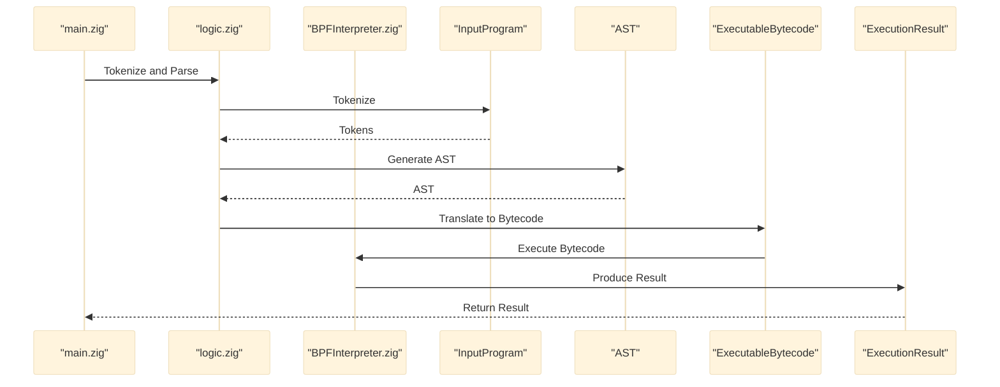
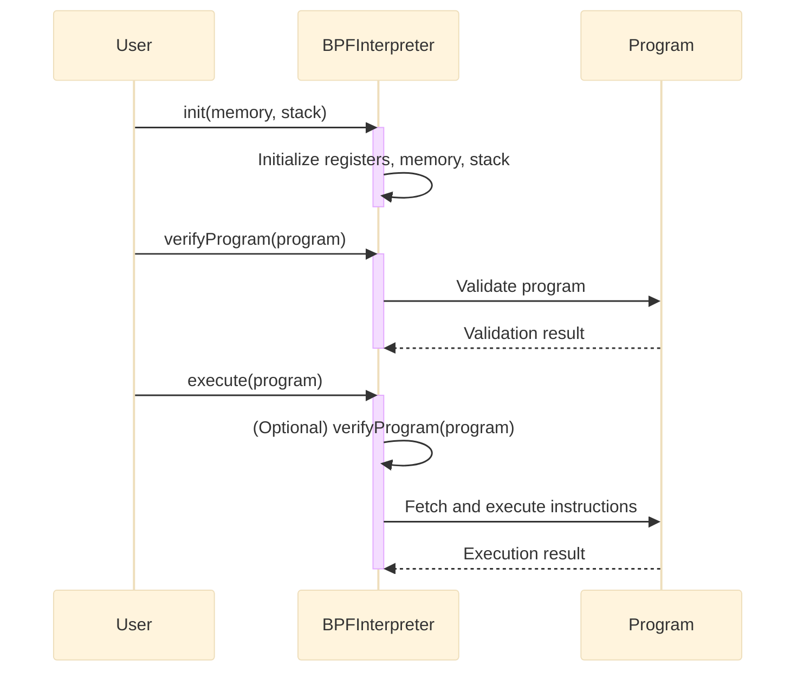

# Zig Compiler

A lightweight compiler and BPF interpreter written in Zig, designed to demonstrate Zig's capabilities in systems programming and compiler construction.

---

## Features

- **Lexical Analysis**: Tokenizes input source code.
- **Parsing**: Constructs an Abstract Syntax Tree (AST) from tokens.
- **Code Generation**: Translates the AST into executable bytecode.(in progress)
- **BPF Interpreter**: Executes Berkeley Packet Filter (BPF) bytecode.

---

## UML Sequence Diagram:




## Bpf interpreter 


# BPF Interpreter Operations

Here’s a list of operations supported by the BPF interpreter based on the code from [`BPFInterpreter.zig`](https://github.com/spreadzp/zig-compiler/blob/7becc7b7fb40b3180358f06012c2a94f3132cb0b/src/BPFInterpreter.zig#L22):

---

## List of Operations

1. **`ADD` (0x00)**  
   - **Description**: Adds the value in register `r1` to register `r0`.  
   - **Operation**: `r0 += r1`

2. **`SUB` (0x01)**  
   - **Description**: Subtracts the value in register `r1` from register `r0`.  
   - **Operation**: `r0 -= r1`

3. **`AND` (0x02)**  
   - **Description**: Performs a bitwise AND operation between `r0` and `r1`.  
   - **Operation**: `r0 &= r1`

4. **`MUL` (0x03)**  
   - **Description**: Multiplies the value in register `r0` by the value in register `r1`.  
   - **Operation**: `r0 *= r1`

5. **`DIV` (0x04)**  
   - **Description**: Divides the value in register `r0` by the value in register `r1`.  
   - **Operation**: `r0 /= r1`  
   - **Error**: Raises `DivisionByZero` if `r1` is zero.

6. **`LD` (0x05)**  
   - **Description**: Loads a 32-bit value from memory into register `r0`.  
   - **Operation**: `r0 = memory[r1..r1+4]`  
   - **Error**: Raises `MemoryOutOfBounds` if the memory access is out of bounds.

7. **`ST` (0x06)**  
   - **Description**: Stores the value in register `r0` into memory at the address in register `r1`.  
   - **Operation**: `memory[r1..r1+4] = r0`  
   - **Error**: Raises `MemoryOutOfBounds` if the memory access is out of bounds.

8. **`OR` (0x07)**  
   - **Description**: Performs a bitwise OR operation between `r0` and `r1`.  
   - **Operation**: `r0 |= r1`

9. **`XOR` (0x08)**  
   - **Description**: Performs a bitwise XOR operation between `r0` and `r1`.  
   - **Operation**: `r0 ^= r1`

10. **`PUSH` (0x09)**  
    - **Description**: Pushes the value in register `r0` onto the stack.  
    - **Operation**: `stack[stack_ptr..stack_ptr+4] = r0`  
    - **Error**: Raises `StackOverflow` if the stack is full.

11. **`POP` (0x0A)**  
    - **Description**: Pops a value from the stack into register `r0`.  
    - **Operation**: `r0 = stack[stack_ptr-4..stack_ptr]`  
    - **Error**: Raises `StackUnderflow` if the stack is empty.

12. **`JMP` (0x10)**  
    - **Description**: Jumps to a new program counter (PC) location based on an offset.  
    - **Operation**: `pc += offset`  
    - **Error**: Raises `InvalidJump` if the jump is out of bounds.

13. **`CALL` (0x11)**  
    - **Description**: Calls a subroutine by jumping to a new PC location and pushing the return address onto the stack.  
    - **Operation**:  
      - Push `pc + 2` onto the stack.  
      - `pc += offset`  
    - **Error**: Raises `InvalidJump` if the jump is out of bounds or `StackOverflow` if the stack is full.

14. **`EXIT` (0x12)**  
    - **Description**: Terminates the execution of the BPF program.  
    - **Operation**: Ends the program.

15. **Unknown Opcode**  
    - **Description**: Raises an error if an unknown opcode is encountered.  
    - **Error**: Raises `UnknownOpcode`.

---

## Error Handling

The interpreter raises specific errors for invalid operations:
- **`UnknownOpcode`**: Unknown or unsupported opcode.
- **`DivisionByZero`**: Division by zero.
- **`MemoryOutOfBounds`**: Memory access out of bounds.
- **`StackOverflow`**: Stack is full (cannot push).
- **`StackUnderflow`**: Stack is empty (cannot pop).
- **`InvalidJump`**: Invalid jump location.

---


## Project Structure
- main.zig: Entry point for the compiler and BPF interpreter.

- BPFInterpreter.zig: Implements a virtual machine for executing BPF bytecode.

- logic.zig: Contains the core compiler logic (lexer, parser, code generator).

- test.zig: Unit tests for the BPF interpreter and compiler.

## Installation
1. Clone the repository:
   ```bash
   git clone https://github.com/spreadzp/zig-compiler.git
   ```
2. Build the project:
   ```bash
   zig build
   ```
 3.   Tests: 
 ```
 zig test src/test.zig
 ```

## Summary

The BPF interpreter supports a variety of operations, including arithmetic, memory access, stack manipulation, and control flow. It includes robust error handling to ensure safe execution of BPF programs. This list provides a clear overview of the supported operations and their behavior.

## Contributing
Contributions are welcome! Please open an issue or submit a pull request.

## License
MIT


 
